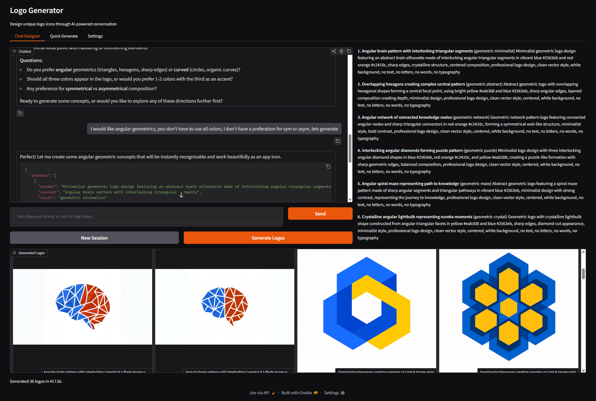
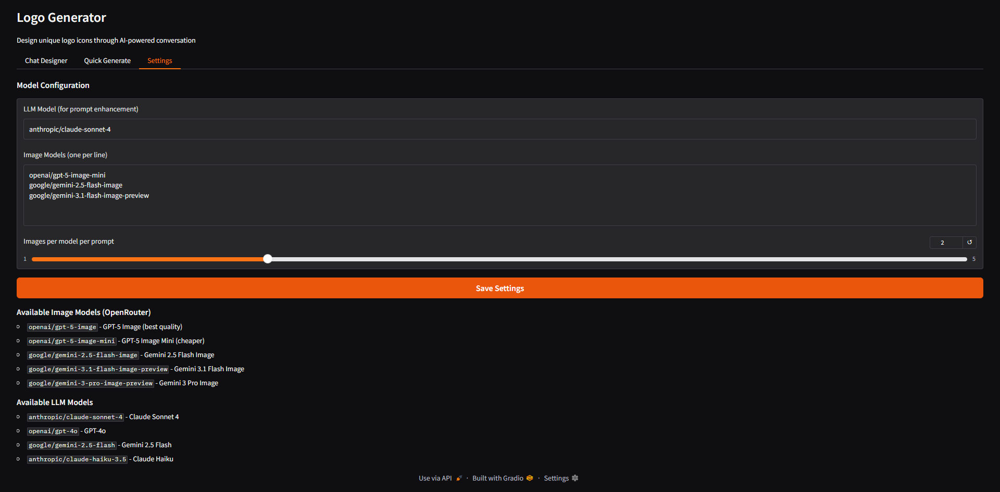

<p align="center">
  
</p>

<h1 align="center">Logo Generator</h1>

<p align="center">AI-powered logo design tool that creates unique brand icons through interactive conversation or one-shot generation. Uses multiple image generation models via OpenRouter for diverse results.</p>

> **Warning:** This tool uses paid API credits via OpenRouter for both LLM prompt enhancement and image generation. Every chat message and every generated image costs credits. There is currently no free tier or local generation option. Make sure your OpenRouter account has sufficient credits before use.

## Screenshots

### Chat Designer
Interactive brand consultation with AI-generated logo results:



### Settings
Configure LLM and image generation models:



## Features

- **Chat Designer** - Conversational brand consultation: describe your brand, the AI asks clarifying questions, then generates optimized prompts and images
- **Quick Generate** - One-shot mode: describe a concept, get 4 diverse prompt variations generated across multiple models
- **Multi-Model Generation** - Same prompt runs through GPT-5 Image, Gemini Flash, and more for varied interpretations
- **Seed Variation** - Multiple seeds per model for even more diversity
- **LLM Prompt Enhancement** - Claude Sonnet 4 transforms simple descriptions into detailed, optimized image generation prompts
- **Icon-Only Designs** - Focused on unique symbols and abstract marks, no text/typography

> **Warning:** This tool uses paid API credits via OpenRouter for both LLM prompt enhancement and image generation. Every chat message and every generated image costs credits. There is currently no free tier or local generation option. Make sure your OpenRouter account has sufficient credits before use.

## Quick Start

```bash
# Clone and setup
git clone <repo-url>
cd logo-gen

# Create .env with your OpenRouter API key
echo "OPENROUTER_KEY=sk-or-v1-your-key-here" > .env

# Install and run
uv sync
uv run logo-gen
```

Opens at `http://localhost:7860`

## Configuration

Edit settings in the UI (Settings tab) or via environment variables:

| Variable | Default | Description |
|----------|---------|-------------|
| `OPENROUTER_KEY` | - | Your OpenRouter API key (required) |
| `LLM_MODEL` | `anthropic/claude-sonnet-4` | LLM for prompt enhancement |
| `IMAGE_MODELS` | GPT-5 Image Mini, Gemini 2.5/3.1 Flash | Image generation models |
| `IMAGES_PER_MODEL` | `2` | Seed variations per model per prompt |
| `OUTPUT_DIR` | `output` | Where generated images are saved |

### Available Image Models (OpenRouter)

- `openai/gpt-5-image` - Best quality, most expensive
- `openai/gpt-5-image-mini` - Good quality, cheaper
- `google/gemini-2.5-flash-image` - Gemini 2.5 Flash
- `google/gemini-3.1-flash-image-preview` - Gemini 3.1 Flash
- `google/gemini-3-pro-image-preview` - Gemini 3 Pro

## Project Structure

```
src/logo_gen/
  config.py              # Settings (pydantic-settings, reads .env)
  prompt_engine.py       # LLM prompt enhancement & chat session
  generator.py           # Multi-model generation orchestrator
  app.py                 # Gradio web UI
  clients/
    openrouter.py        # OpenRouter API client (LLM + image gen)
```

## How It Works

1. **Prompt Enhancement** - Your concept is sent to an LLM (Claude Sonnet 4) which generates 4-6 diverse, detailed image generation prompts, each exploring a different visual direction
2. **Multi-Model Generation** - Each prompt is sent to multiple image models with different random seeds
3. **Results** - All generated logos are displayed in a gallery for comparison

## Requirements

- Python 3.12+
- [uv](https://docs.astral.sh/uv/) package manager
- OpenRouter API key with credits
