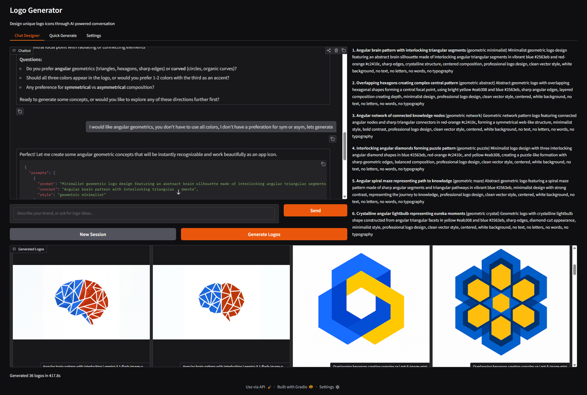
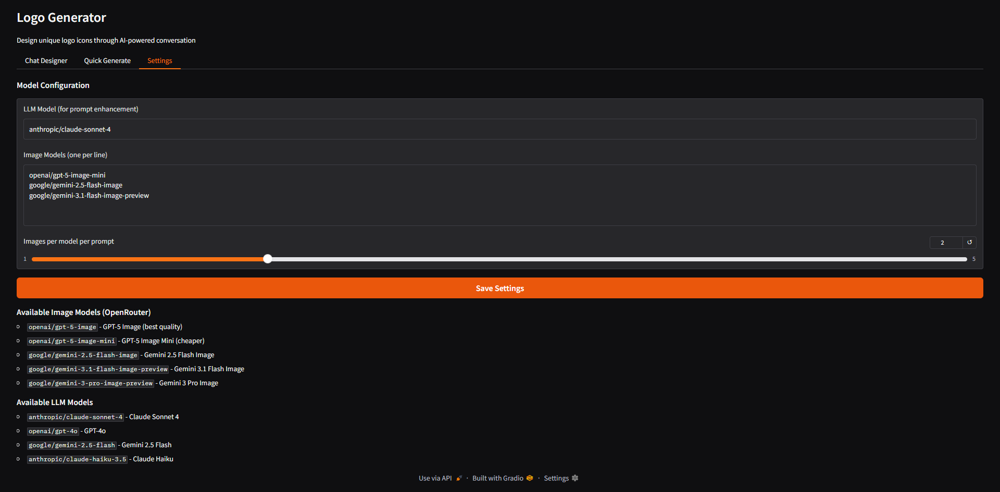

<p align="center">
  
</p>

<h1 align="center">Logo Generator</h1>

<p align="center">AI-powered logo design tool that creates unique brand icons through interactive conversation or one-shot generation. Supports both local models (free, offline) and cloud models via OpenRouter.</p>

> **Note:** Cloud models (OpenRouter) require paid API credits. Local models (FLUX.1 Schnell, Z-Image-Turbo) run entirely on your GPU at no cost. You can mix both in the same session.

## Screenshots

### Chat Designer
Interactive brand consultation with AI-generated logo results:



### Settings
Configure LLM and image generation models:



## Features

- **Chat Designer** - Conversational brand consultation: describe your brand, the AI asks clarifying questions, then generates optimized prompts and images
- **Quick Generate** - One-shot mode: describe a concept, get 4 diverse prompt variations generated across multiple models
- **Multi-Model Generation** - Same prompt runs through local and/or cloud models for varied interpretations
- **Local Generation** - FLUX.1 Schnell and Z-Image-Turbo run on your GPU with no API costs
- **Seed Variation** - Multiple seeds per model for even more diversity
- **LLM Prompt Enhancement** - Claude Sonnet 4 transforms simple descriptions into detailed, optimized image generation prompts
- **Icon-Only Designs** - Focused on unique symbols and abstract marks, no text/typography
- **Upscaling** - 4 methods: Lanczos, Bicubic, Real-ESRGAN Anime (best for flat logos), Real-ESRGAN General (best for complex logos). Supports 2x, 4x, 8x scales with GPU acceleration
- **Background Removal** - 5 rembg models (U2-Net, ISNet, BiRefNet, etc.) with alpha matting support. Reads from both generated and upscaled folders

## Quick Start

```bash
# Clone and setup
git clone <repo-url>
cd logo-gen
uv sync

# Option A: Local models only (free, no API key needed)
# Just run - local models download automatically on first use
uv run logo-gen

# Option B: Cloud models (requires OpenRouter API key)
echo "OPENROUTER_KEY=sk-or-v1-your-key-here" > .env
uv run logo-gen
```

Opens at `http://localhost:7860`. Configure models in the **Settings** tab.

## Configuration

Edit settings in the UI (Settings tab) or via environment variables:

| Variable | Default | Description |
|----------|---------|-------------|
| `OPENROUTER_KEY` | - | OpenRouter API key (only needed for cloud models) |
| `HF_TOKEN` | - | HuggingFace token (optional, speeds up model downloads) |
| `LLM_MODEL` | `anthropic/claude-sonnet-4` | LLM for prompt enhancement (`local/` prefix for local) |
| `LOCAL_LLM_BASE_URL` | `http://localhost:11434/v1` | Local LLM API endpoint |
| `LOCAL_LLM_MODEL` | `qwen3.5:9b` | Default local model name |
| `LOCAL_LLM_API_KEY` | - | API key for authenticated local endpoints |
| `IMAGE_MODELS` | GPT-5 Image Mini, Gemini 2.5/3.1 Flash | Image generation models |
| `IMAGES_PER_MODEL` | `2` | Seed variations per model per prompt |
| `OUTPUT_DIR` | `output` | Where generated images are saved |

### Available Image Models

#### Local Models (free, offline)

| Model | Speed | VRAM | License | Notes |
|-------|-------|------|---------|-------|
| `flux1-schnell` | ~14s | ~10 GB | Apache 2.0 | Best detail, 4 steps |
| `zimage-turbo` | ~17s | ~8-10 GB | Apache 2.0 | Clean minimal style, 9 steps |

Local models are downloaded automatically on first use to `.models/` (~25 GB total). They use BNB 4-bit quantization to fit on consumer GPUs.

#### Cloud Models (OpenRouter)

- `openai/gpt-5-image` - Best quality, most expensive
- `openai/gpt-5-image-mini` - Good quality, cheaper
- `google/gemini-2.5-flash-image` - Gemini 2.5 Flash
- `google/gemini-3.1-flash-image-preview` - Gemini 3.1 Flash
- `google/gemini-3-pro-image-preview` - Gemini 3 Pro

You can mix local and cloud models in the image models list.

## Project Structure

```
src/logo_gen/
  config.py              # Settings (pydantic-settings, reads .env)
  prompt_engine.py       # LLM prompt enhancement & chat session
  generator.py           # Multi-model generation orchestrator
  upscaler.py            # Image upscaling (Lanczos, Bicubic, Real-ESRGAN)
  postprocess.py         # Background removal (rembg)
  app.py                 # Gradio web UI (5 tabs)
  clients/
    openrouter.py        # OpenRouter API client (LLM + image gen)
    local_diffusion.py   # Local GPU generation (FLUX.1 Schnell, Z-Image-Turbo)
    local_llm.py         # Local LLM client (Ollama, vLLM, LM Studio, etc.)
```

### Output Structure

```
output/
  generated/   # AI-generated logos
  upscaled/    # Upscaled versions
  cleaned/     # Background-removed versions
```

## Local LLM Setup (Optional)

For **free, offline prompt enhancement**, you can run a local LLM instead of using OpenRouter. Set `LLM_MODEL=local/<model-name>` in the Settings tab or `.env` file. The app connects to any **OpenAI-compatible API** on your machine.

Choose a server that fits your environment:

<table>
<tr>
<th>Server</th>
<th>Best For</th>
<th>Install</th>
</tr>
<tr>
<td><b><a href="https://ollama.com">Ollama</a></b></td>
<td>Easiest setup, beginner friendly</td>
<td>

```bash
# Windows
winget install Ollama.Ollama

# macOS
brew install ollama

# Linux
curl -fsSL https://ollama.com/install.sh | sh

# Then pull a model and it starts serving automatically
ollama pull qwen3.5:9b
```

</td>
</tr>
<tr>
<td><b><a href="https://docs.vllm.ai">vLLM</a></b></td>
<td>Production, high throughput</td>
<td>

```bash
# Install (requires CUDA)
uv pip install vllm --extra-index-url https://wheels.vllm.ai/nightly

# Serve a model
vllm serve Qwen/Qwen3.5-9B --dtype bfloat16 --port 8000
```

</td>
</tr>
<tr>
<td><b><a href="https://lmstudio.ai">LM Studio</a></b></td>
<td>Desktop GUI, download models visually</td>
<td>

Download from [lmstudio.ai](https://lmstudio.ai), load a model, and enable the local server in settings.

</td>
</tr>
<tr>
<td><b><a href="https://github.com/oobabooga/text-generation-webui">text-generation-webui</a></b></td>
<td>Advanced users, many backends</td>
<td>

See the [project README](https://github.com/oobabooga/text-generation-webui#installation) for install instructions. Enable the OpenAI-compatible API extension.

</td>
</tr>
</table>

Then configure in `.env`:

```bash
LLM_MODEL=local/qwen3.5:9b

# Default endpoint (Ollama)
LOCAL_LLM_BASE_URL=http://localhost:11434/v1

# For vLLM
# LOCAL_LLM_BASE_URL=http://localhost:8000/v1

# For LM Studio
# LOCAL_LLM_BASE_URL=http://localhost:1234/v1

# Optional: API key for authenticated endpoints
# LOCAL_LLM_API_KEY=sk-...
```

### Recommended Models

| Model | Size | VRAM (Q4) | Notes |
|-------|------|-----------|-------|
| `qwen3.5:9b` | 9B | ~5 GB | Best quality/size ratio, recommended |
| `qwen3.5:4b` | 4B | ~3 GB | Lighter, still good for prompt enhancement |
| `gemma3:12b` | 12B | ~7 GB | Strong alternative |
| `mistral-nemo` | 12B | ~7 GB | Good multilingual support |

## How It Works

1. **Prompt Enhancement** - Your concept is sent to an LLM (local or cloud) which generates 4-6 diverse, detailed image generation prompts, each exploring a different visual direction
2. **Multi-Model Generation** - Each prompt is sent to multiple image models (local GPU or cloud) with different random seeds
3. **Upscaling** - Optionally upscale to 2x/4x/8x using AI (Real-ESRGAN) or classical (Lanczos/Bicubic) methods
4. **Background Removal** - Remove backgrounds with your choice of 5 neural network models
5. **Results** - All generated logos are displayed in galleries for comparison

## Requirements

- Python 3.12+
- [uv](https://docs.astral.sh/uv/) package manager
- NVIDIA GPU with 10+ GB VRAM (for local image generation)
- OpenRouter API key (only if using cloud models)
- Ollama, vLLM, or LM Studio (only if using local LLM for prompt enhancement)

## GPU / CPU Setup

**Local image generation requires an NVIDIA GPU with CUDA.** Cloud models (OpenRouter) work without a GPU.

The project is configured to install CUDA-enabled PyTorch from the `cu124` index. Verify GPU detection:

```bash
uv run python -c "import torch; print('CUDA:', torch.cuda.is_available())"

# If False, reinstall torch with CUDA:
uv pip install torch --index-url https://download.pytorch.org/whl/cu124 --force-reinstall
```

### VRAM Requirements

| Feature | VRAM | Notes |
|---------|------|-------|
| **FLUX.1 Schnell** (local) | ~10 GB | BNB 4-bit quantized, 4 steps |
| **Z-Image-Turbo** (local) | ~8-10 GB | BNB 4-bit quantized, 9 steps |
| Cloud models (OpenRouter) | 0 | Runs on remote servers |
| Lanczos / Bicubic upscaling | 0 | CPU only |
| Real-ESRGAN Anime 6B | ~1.5 GB | Best for flat/illustrative logos |
| Real-ESRGAN General x4 | ~2.5 GB | Best for complex logos |

Local models are downloaded on first use to `.models/` in the project directory. Images larger than 512x512 are processed in tiles during upscaling to avoid VRAM overflow.

> **Windows note:** If you encounter segfaults or "paging file too small" errors when loading local models, increase your Windows virtual memory (pagefile) to at least 1.5x your RAM via System Properties > Advanced > Performance > Virtual Memory.
